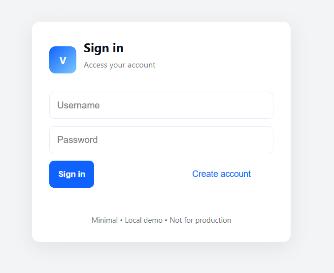
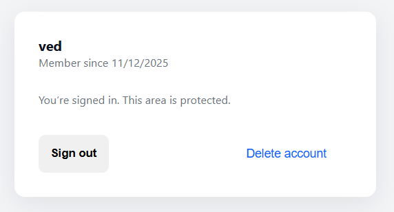

# 🔐 Login Authentication (Local Demo)

A minimal and elegant **login & registration system** built using **HTML, CSS, and vanilla JavaScript**.
This demo securely stores user credentials in the browser using **localStorage + SHA-256 hashing**, making it ideal for learning authentication concepts and UI design.

---

## ⭐ Features

* Clean and modern UI built with pure CSS
* Create Account + Sign In flow
* SHA-256 password hashing (no plaintext storage)
* LocalStorage-based account persistence
* Error handling and form validation
* Protected “Signed-In Area” view
* Ability to delete account
* Fully responsive design

---

## 📁 Project Structure

```
project/
│── index.html
│── README.md
└── assets/
    └── banner.png
```

---

## 🚀 Live Demo (Local)

Run using any local server:

```bash
python -m http.server
```

Then open:

```
http://localhost:8000
```

---

## 🧠 How It Works

### 🔸 Registration

* User enters username, email, password
* Password is hashed using **SHA-256**
* Data is stored in localStorage as:

```
{ username: { email, hash, createdAt } }
```

### 🔸 Login

* User enters username + password
* Hash is compared with stored value
* On success, user enters a protected area

### 🔸 Protected View

Displays:

* Username
* Account creation date
* Sign out & Delete account options

---

## 🛠 Technologies Used

| Technology                 | Purpose              |
| -------------------------- | -------------------- |
| **HTML5**                  | Structure            |
| **CSS3**                   | Styling (Custom UI)  |
| **JavaScript (Vanilla)**   | Authentication logic |
| **LocalStorage**           | Data persistence     |
| **SHA-256 Web Crypto API** | Secure hashing       |

---

## 📸 Screenshots

### 🔐 Login Screen


### 📝 Create Account Screen


### 🟢 Signed-In Dashboard


---

## ⚠️ Important Note

This authentication is **for learning purposes only**.
It should **NOT** be used in real applications because:

* LocalStorage is not secure
* No backend or database
* No session tokens

---

## 📄 License

MIT License. Free to use, learn, and modify.

---

## 🙌 Author

Built by **Vedansh Harish Ail**.

---
